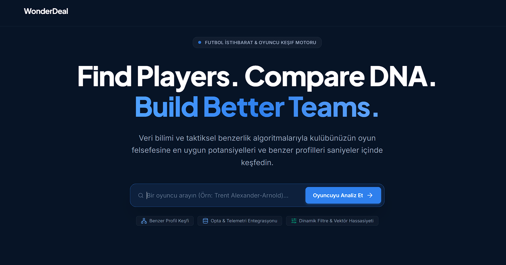
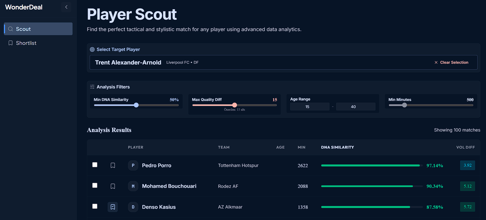
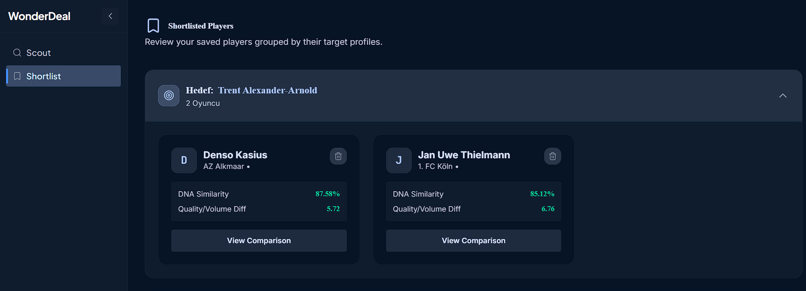
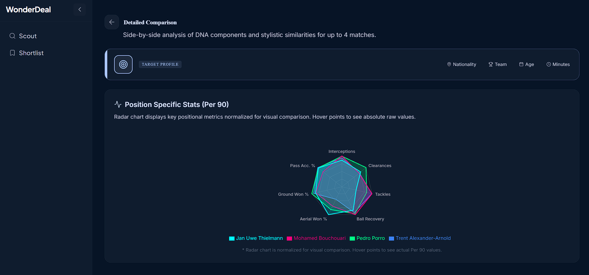

# WonderDeal Scouting Platform

WonderDeal, veri odaklı gelişmiş bir futbol scouting (oyuncu izleme) platformudur. Makine öğrenmesi (PCA - Temel Bileşenler Analizi) kullanarak oyuncu profillerini analiz eder, oyuncular arasındaki benzerlikleri hesaplar ve mevkisine özel (90 dakika başına ölçeklenmiş) istatistiklere dayanarak en kusursuz "DNA eşleşmelerini" bulur.

İster bir sonraki "Kylian Mbappé"yi arıyor olun, ister takımdan ayrılan ilk 11 orta sahanızın yerini doldurmaya çalışın; WonderDeal taktiksel benzerlikleri ve istatistiksel kesişimleri hesaplayarak size en iyi, veriye dayalı tavsiyeleri sunar.



## Ozellikler
- **Veri Odaklı Scouting:** Forvetleri, orta sahaları ve defans oyuncularını değerlendirmek için sağlam istatistiksel veriler (90 dakika başına ölçeklenmiş) kullanır.
- **PCA Benzerlik Motoru:** Yüksek boyutlu karmaşık istatistikleri temel "DNA" özelliklerine indirgemek için Temel Bileşenler Analizi (PCA) uygular. Böylece sadece genel reytingi yüksek olanları değil, *gerçekten* hedef oyuncuya benzer tarzda oynayan oyuncuları bulur.
- **Mevkiye Özel Radar Grafikleri:** Hedef oyuncu ile eşleşen oyuncuları, o mevki için kritik olan özellikler üzerinden görsel olarak kıyaslamanızı sağlar.
- **Dinamik Kısa Liste (Shortlist):** İncelediğiniz ve beğendiğiniz oyuncuları yer imlerine ekleyin ve orijinal hedeflere göre gruplandırılmış şekilde daha sonra tekrar kıyaslayın.

---

## Ekran Goruntuleri

Aşağıda uygulamanın temel işlevlerini gösteren bazı ekran görüntüleri bulunmaktadır:

| Ana Sayfa & Oyuncu Arama | Scout (Keşif) Sonuçları |
| :---: | :---: |
|  |  |
| **Kısa Liste (Shortlist)** | **Detaylı Radar Kıyaslaması** |
|  |  |

---

## Kullanılan Teknolojiler (Tech Stack)
- **Frontend (Onyuz):** React, Vite, TailwindCSS, Zustand (Durum Yönetimi), Recharts (Veri Görselleştirme), Lucide React.
- **Backend (Arkayuz):** Python, FastAPI, Pandas, Scikit-Learn (PCA, StandardScaler, PowerTransformer).
- **Veri:** Hızlı sonuçlar için CSV dosyalarını sunucu başlatıldığında doğrudan RAM belleğe yükler.

---

## Gereksinimler
Bu projeyi bilgisayarınızda (yerel ortamda) çalıştırmak için şunlara ihtiyacınız vardır:
- **Node.js** (v16.0 veya üzeri önerilir)
- **Python** (v3.9 veya üzeri önerilir)
- **Git**

---

## Yerel Kurulum ve Calıstırma

### 1. Depoyu (Repository) Klonlayın
```bash
git clone <github-repo-linkiniz>
cd Scouting
```

### 2. Backend Kurulumu (FastAPI)
Backend Python ve FastAPI ile inşa edilmiştir. Başlangıçta CSV verilerini yükler, PCA modellerini hafızaya alır ve REST API hizmeti sunar.

```bash
cd backend
# Sanal ortam (virtual environment) oluşturun
python -m venv venv

# Sanal ortamı aktifleştirin
# Windows için:
venv\Scripts\activate
# macOS/Linux için:
source venv/bin/activate

# Gerekli bağımlılıkları yükleyin
pip install fastapi uvicorn pandas numpy scikit-learn
```

Backend sunucusunu başlatın:
```bash
python -m uvicorn main:app --reload
```
*API şu adreste çalışmaya başlayacaktır: http://127.0.0.1:8000*

### 3. Frontend Kurulumu (React/Vite)
**Yeni bir terminal penceresi/sekmesi** açın ve frontend dizinine gidin.

```bash
cd frontend

# Node bağımlılıklarını yükleyin
npm install

# Geliştirme sunucusunu başlatın
npm run dev
```
*Web uygulaması şu adreste çalışmaya başlayacaktır: http://localhost:5173*

### 4. Cevre Degiskenleri (Istege Baglı)
Proje yerel geliştirme için kutudan çıktığı gibi çalışır. Eğer API URL'sini canlı sunucu (production) için değiştirmek isterseniz, ana dizindeki örnek .env dosyasını kopyalayabilirsiniz:

```bash
cp .env.example .env
```
Ardından `.env` dosyasının içindeki `VITE_API_URL` değişkenini kendi sunucu adresinize göre güncelleyin.

---

## Proje Yapısı
```text
Scouting/
│
├── backend/                # FastAPI uygulaması ve Makine Öğrenmesi (ML) Mantığı
│   ├── main.py             # API Uç Noktaları ve PCA başlatma süreçleri
│   └── models/             # Otomatik üretilen .pkl modelleri için klasör
│
├── frontend/               # React Vite Uygulaması
│   ├── src/
│   │   ├── components/     # Tekrar kullanılabilir arayüz bileşenleri (Grafikler, Tablolar)
│   │   ├── pages/          # Uygulama Sayfaları (Scout, Compare, Shortlist)
│   │   ├── store/          # Zustand durum yönetimi (State management)
│   │   └── utils/          # Yardımcı fonksiyonlar (renk eşlemeleri vb.)
│
└── data_pipeline/          # Ham CSV veri setleri ve kazıma kodları
    ├── temizlenmis_24_25.csv
    └── ...
```

---

## Guvenlik ve Veri
- **Veri Gizliliği:** Ham veriler `data_pipeline/` klasörü içinde CSV formatında yerel olarak saklanır. Varsayılan olarak herhangi bir dış veritabanı bağlantısı gerektirmez.
- **Modeller:** Makine öğrenmesi model durumlarını tutan `.pkl` dosyaları, mevcut değilse başlatma sırasında `main.py` tarafından otomatik olarak okunur veya oluşturulur.

---

## Katkıda Bulunma
Katkılarınız, bulduğunuz hatalar (issues) ve yeni özellik talepleriniz memnuniyetle karşılanır! Katkıda bulunmak isterseniz "Issues" sekmesini kontrol edebilirsiniz.

## Lisans
Bu proje açık kaynak kodludur ve [MIT Lisansı](LICENSE) altında kullanıma sunulmuştur.
