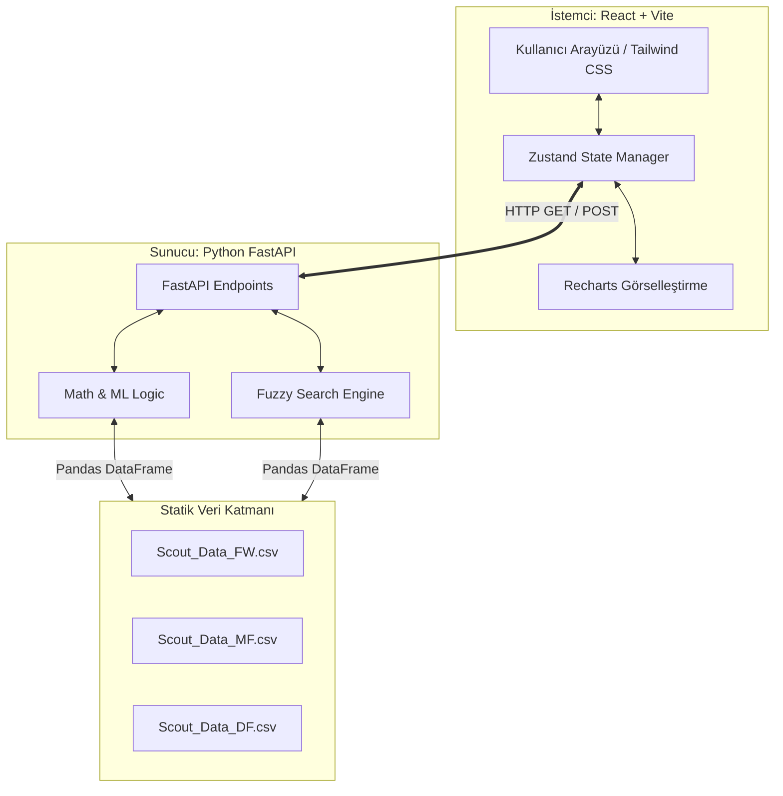

# Teknik Gereksinimler Belgesi (TRD)
**Proje Adı:** WonderDeal Scouting Engine
**Tarih:** 2026-09-04
**Sürüm:** 1.0.0

---

## 1. Giriş ve Kapsam

### 1.1. Projenin Amacı
Bu belge (TRD), "WonderDeal Scouting Engine" platformunun teknik altyapısını, mimari kararlarını, API uç noktalarını ve ön yüz (frontend) bileşenlerini detaylandırmak amacıyla hazırlanmıştır. Projenin ana hedefi, futbol kulüpleri ve profesyonel scoutlar için, makine öğrenimi (PCA ve KNN) teknikleri kullanılarak hazırlanmış verisetleri üzerinden taktiksel oyuncu keşfi ve "DNA Benzerliği" hesaplaması yapan interaktif bir web platformu sunmaktır.

### 1.2. Mimari Kararlar ve Uyumluluk
Bu belge; `INTENT.md`, `DESIGN.md`, `MEMORY.md` ve özellikle anayasa niteliğindeki `AGENT.md` belgelerindeki kurallara %100 sadık kalınarak hazırlanmıştır.
*   **Mimari:** Python (FastAPI) Backend + React (Vite) Frontend.
*   **Veri Yönetimi:** Ön yüz durumu (state) **Zustand** ile yönetilecek, algoritmik aramalar Backend'de gerçekleşecektir.
*   **Arama (Search):** İstemci performansını korumak amacıyla hatalı yazım toleranslı (Fuzzy Search) aramalar Backend tarafında çözülecektir.

---

## 2. Sistem Mimarisi

Sistem, istemci ve sunucu olmak üzere iki ana katmandan oluşmaktadır. Veri güvenliğini sağlamak ve makine öğrenimi ağırlıklarını gizlemek adına tüm mantıksal işlemler sunucuda izole edilmiştir.

### 2.1. Bileşen Diyagramı



### 2.2. Veri Akışı (Data Flow)
1.  **Başlangıç (Initialization):** FastAPI sunucusu ayağa kalktığında `FW`, `MF` ve `DF` CSV dosyaları RAM'e (Pandas DataFrame olarak) yüklenir.
2.  **Sorgu (Query):** Kullanıcı arayüzde "Moisés" yazdığında `GET /api/search` tetiklenir.
3.  **Fuzzy Search:** Backend, tüm DataFrame'lerdeki `Oyuncu` sütununu tarar ve en yakın eşleşmeleri (Moisés Caicedo vb.) Frontend'e döner.
4.  **Hesaplama (Computation):** Kullanıcı hedef oyuncuyu seçip "Karşılaştır" dediğinde `POST /api/compare` tetiklenir. Backend ilgili mevkinin DataFrame'ini alır, Kosinüs Benzerliği (Cosine Similarity) ve Öklid Uzaklığı (Euclidean Distance) hesaplar, filtreleri uygular ve sonuçları JSON olarak Frontend'e yollar.

---

## 3. Veri Şeması ve Modelleri

Model hesaplamaları sonucunda üretilen veriler, mevki bazlı olarak (Forvet, Orta Saha, Defans) dışa aktarılmıştır. Tüm CSV dosyaları standart bir sütun mimarisini paylaşır.

### 3.1. CSV Sütun Yapısı (Örn: `Scout_Data_MF.csv`)

| Sütun Adı  | Veri Tipi | Açıklama |
| :--- | :--- | :--- |
| `Oyuncu`   | `String` | Futbolcunun tam adı (Fuzzy search için temel alan). |
| `PC1` - `PC10` | `Float` | Temel Bileşen Analizi (PCA) algoritmasından elde edilen vektör uzayı değerleri. |
| `Yaş`      | `Float` / `Int` | Oyuncunun mevcut yaşı. Parametrik filtrelemede kullanılır. |
| `Millet`   | `String` | Oyuncunun uyruğu (Örn: `ec ECU`, `eng ENG`). |
| `Pozisyon` | `String` | Oynadığı pozisyon(lar). (Örn: `MF,DF`, `MF`). |
| `Takım`    | `String` | Güncel olarak forma giydiği kulüp. |
| `Dakika`   | `Int` | Sezon içinde aldığı toplam süre. Filtreleme için kritiktir. |

### 3.2. Backend (Pydantic) Modelleri

FastAPI tarafında gelen ve giden verileri doğrulamak (validation) için aşağıdaki Pydantic modelleri kullanılacaktır:

```python
from pydantic import BaseModel
from typing import List, Optional

class SearchResponseItem(BaseModel):
    oyuncu_adi: str
    pozisyon_grubu: str # "FW", "MF" veya "DF"
    takim: str
    yas: float
    dakika: int

class CompareRequest(BaseModel):
    hedef_oyuncu: str
    pozisyon_grubu: str # "FW", "MF", "DF"
    min_yas: Optional[int] = 16
    max_yas: Optional[int] = 40
    min_dakika: Optional[int] = 500
    hedef_ligler: Optional[List[str]] = None

class CompareResponseItem(BaseModel):
    oyuncu: str
    yas: float
    millet: str
    pozisyon: str
    takim: str
    dakika: int
    dna_benzerligi: float # 0.0 - 100.0 arası
    kalite_farki: float # Öklid uzaklığı delta değeri
    pc_degerleri: List[float] # Radar grafiği için [PC1, PC2, PC3, PC4, PC5]
```

---

## 4. Backend (FastAPI) Spesifikasyonları

Python tabanlı arka uç, performansı maksimize etmek için verileri uygulama başlangıcında önbelleğe (memory) almalıdır.

### 4.1. Veri Yükleme Mekanizması

Uygulama `lifespan` event'i ile başlatıldığında `Pandas` kullanılarak CSV'ler okunacaktır.

```python
import pandas as pd
from fastapi import FastAPI

# Global state
data_frames = {}

async def lifespan(app: FastAPI):
    # Uygulama başlarken verileri RAM'e al
    data_frames['FW'] = pd.read_csv("Scout_Data_FW.csv")
    data_frames['MF'] = pd.read_csv("Scout_Data_MF.csv")
    data_frames['DF'] = pd.read_csv("Scout_Data_DF.csv")
    yield
    # Uygulama kapanırken temizle
    data_frames.clear()

app = FastAPI(lifespan=lifespan)
```

### 4.2. Endpoints (Uç Noktalar)

#### 4.2.1. GET `/api/search`
*   **Açıklama:** Kullanıcının girdiği metne göre hatalı yazım toleranslı (Fuzzy) arama yapar.
*   **Parametreler:** `q` (String, Zorunlu) - Aranan oyuncu adı.
*   **Algoritma:** `RapidFuzz` veya `difflib` kütüphanesi kullanılarak 3 DataFrame birleştirilmiş bir indeks üzerinden aranır. Levenshtein mesafesine göre en yüksek eşleşme skoruna sahip ilk 10 kayıt döndürülür.
*   **Yanıt Örneği (200 OK):**
```json
{
  "results": [
    {
      "oyuncu_adi": "Moisés Caicedo",
      "pozisyon_grubu": "MF",
      "takim": "Chelsea",
      "yas": 22.0,
      "dakika": 3351
    }
  ]
}
```

#### 4.2.2. POST `/api/compare`
*   **Açıklama:** Hedef oyuncunun PC vektörleri ile aynı mevki havuzundaki diğer oyuncuların PC vektörlerini karşılaştırır.
*   **İstek Gövdesi (Body):** `CompareRequest` modeli.
*   **İşlem Adımları:**
    1.  `pozisyon_grubu` parametresine göre ilgili DataFrame seçilir.
    2.  `hedef_oyuncu` satırı bulunur ve PC1-PC10 değerleri `V_hedef` vektörü olarak ayrılır.
    3.  Aynı pozisyondaki diğer tüm oyuncuların PC1-PC10 değerleri `V_diger` matrisi olarak alınır.
    4.  Filtreler (yaş, dakika) uygulanarak havuz daraltılır.
    5.  Kosinüs Benzerliği ve Öklid Uzaklığı hesaplanır.
*   **Yanıt Örneği (200 OK):**
```json
{
  "target": {
    "oyuncu": "Moisés Caicedo",
    "pc_degerleri": [-4.15, 3.86, -2.44, 1.70, -0.44]
  },
  "matches": [
    {
      "oyuncu": "Remo Freuler",
      "yas": 32.0,
      "takim": "Bologna",
      "dakika": 3204,
      "dna_benzerligi": 91.4,
      "kalite_farki": 1.2,
      "pc_degerleri": [-4.42, 2.38, -0.56, -0.26, -0.19]
    }
  ]
}
```

---

## 5. Matematiksel Modeller ve Algoritmalar

### 5.1. DNA Benzerliği (Kosinüs Benzerliği - Cosine Similarity)
Taktiksel rol ve oyuncu "DNA"sı, vektörlerin yönelimini (büyüklüğünden bağımsız olarak) ölçen Kosinüs Benzerliği ile bulunur. Formül:
`Cosine Similarity (A, B) = (A • B) / (||A|| * ||B||)`
Burada A, hedef oyuncunun PC1-PC10 vektörü; B ise havuzdaki bir oyuncunun PC1-PC10 vektörüdür. 
*Uygulama:* `scikit-learn.metrics.pairwise.cosine_similarity` fonksiyonu kullanılarak %0-100 aralığına normalize edilecektir.

### 5.2. Kalite / Hacim Farkı (Öklid Uzaklığı - Euclidean Distance)
İki oyuncunun oyun stili aynı olsa da, oynadıkları veri hacmi ve kaliteleri farklı olabilir. Bu fark, çok boyutlu uzaydaki mutlak mesafe ile hesaplanır. Formül:
`Euclidean Distance (A, B) = √ Σ(Ai - Bi)²`
Öklid uzaklığı düşük olan oyuncu, hedef oyuncuya "kalite ve skor hacmi" olarak daha yakındır.

---

## 6. Frontend (React + Vite) Mimarisi

Ön yüz, `DESIGN.md` dosyasında belirtilen tasarımsal ilkelere sadık kalınarak oluşturulacaktır. Hızlı ve modern bir "Single Page Application" (SPA) yapısı hedeflenmektedir.

### 6.1. Bileşen Ağacı (Component Tree)
```text
src/
├── App.jsx                     # Ana layout (Sidebar + Header + Main Content)
├── store/
│   └── useScoutStore.js        # Zustand global state dosyası
├── components/
│   ├── layout/
│   │   ├── Sidebar.jsx         # Sol navigasyon menüsü
│   │   └── Header.jsx          # Üst bilgi ve kullanıcı alanı
│   ├── search/
│   │   └── PlayerSearch.jsx    # Fuzzy arama barı ve autocomplete
│   ├── filters/
│   │   └── FilterPanel.jsx     # Parametrik kısıtlamalar (Yaş, Dakika, Lig)
│   ├── results/
│   │   ├── ResultsTable.jsx    # Benzer profiller tablosu
│   │   └── MatchProgressBar.jsx# DNA benzerliği çubuk grafik bileşeni
│   └── charts/
│       └── PlayerRadarChart.jsx# Recharts tabanlı örümcek grafik
```

### 6.2. Durum Yönetimi (Zustand)
Tüm filtreler, seçili hedef oyuncu ve API'den dönen benzer oyuncu listesi Zustand kullanılarak merkezi bir `store` içinde tutulacaktır. Bu sayede bileşenler (components) arası "prop drilling" engellenecektir.

```javascript
import { create } from 'zustand';

export const useScoutStore = create((set) => ({
  targetPlayer: null,           // Seçilen hedef oyuncu
  filters: {                    // Aktif filtreler
    ageRange: [18, 35],
    minMinutes: 900,
    targetPosition: 'ALL'
  },
  searchResults: [],            // Karşılaştırma sonrası API'den dönen sonuçlar
  isLoading: false,             // API yüklenme durumu
  
  // Eylemler (Actions)
  setTargetPlayer: (player) => set({ targetPlayer: player }),
  updateFilter: (key, value) => set((state) => ({ 
    filters: { ...state.filters, [key]: value } 
  })),
  setSearchResults: (results) => set({ searchResults: results }),
  setLoading: (status) => set({ isLoading: status })
}));
```

---

## 7. UI/UX ve Tasarım Sistemi (Design System)

`DESIGN.md` ve referans STITCH kodları uyarınca, projenin Tailwind CSS konfigürasyonu aşağıdaki gibi yapılandırılacaktır.

### 7.1. Tailwind Konfigürasyonu (`tailwind.config.js`)
```javascript
export default {
  darkMode: "class",
  content: ["./index.html", "./src/**/*.{js,jsx,ts,tsx}"],
  theme: {
    extend: {
      colors: {
        "surface": "#071426",               // Ana arka plan (Deep Navy)
        "surface-container": "#142032",     // Kart arka planları
        "primary": "#2F80ED",               // Ana mavi vurgu
        "primary-container": "#448ffd",     // Buton hover
        "secondary": "#60A5FA",             // Cyan vurgu
        "accent": "#34d399",                // Başarı / Yüksek benzerlik (Emerald)
        "on-surface": "#F1F5F9",            // Ana metin rengi
        "on-surface-variant": "#94A3B8",    // İkincil metin rengi
        "outline-variant": "rgba(255, 255, 255, 0.08)", // İnce kenarlıklar
      },
      fontFamily: {
        "headline": ["Plus Jakarta Sans", "sans-serif"],
        "body": ["Inter", "sans-serif"],
        "mono": ["JetBrains Mono", "monospace"]
      }
    }
  }
}
```

### 7.2. Stil ve Estetik Kurallar
*   **Glassmorphism:** Yüzen bileşenler (navbar, arama çubuğu sonuç kutusu) `bg-surface/80 backdrop-blur-xl border border-outline-variant` sınıfları ile tasarlanacaktır.
*   **Veri Görselleştirme (Data Visualization):** Yüzdelik dilimler (DNA Benzerliği vb.) düz metin olarak değil, `h-1.5 w-full rounded-full bg-primary/20` yapısındaki ilerleme çubukları (progress bars) ile desteklenecektir.
*   **İkonografi:** Materyal Sembolleri (Material Symbols Outlined) kullanılacaktır.

---

## 8. Performans, Güvenlik ve Dağıtım

### 8.1. Performans Hedefleri
*   **API Yanıt Süresi:** `/api/compare` endpoint'i, 5.000 satırlık veriseti üzerinde matriks işlemi yaparken 200ms'nin (milisaniye) altında yanıt dönmelidir. Pandas matris operasyonları bunun için yeterince hızlıdır.
*   **Frontend Yüklenme Süresi:** Vite build optimizasyonları sayesinde ilk yükleme süresi (FCP) 1 saniyenin altında hedeflenmektedir.

### 8.2. Güvenlik ve İzolasyon
*   **Model Gizliliği:** "AGENT.md" kuralı gereği; CSV dosyaları, makine öğrenimi mantığı, PCA öznitelikleri ve matematiksel hesaplamalar Frontend kodlarına kesinlikle dahil edilmeyecektir. İstemci sadece JSON sonuçlarını görür.
*   **CORS Ayarları:** FastAPI üzerinde CORS (Cross-Origin Resource Sharing) middleware'i aktifleştirilecek, yalnızca React uygulamasının çalıştığı domaine (örn: `http://localhost:5173`) izin verilecektir.

### 8.3. Yerel Çalıştırma (Development)
Sistem iki terminal sekmesinde ayağa kaldırılır:
1.  **Backend:** `cd backend && pip install -r requirements.txt && uvicorn app:app --reload`
2.  **Frontend:** `cd frontend && npm install && npm run dev`

---
*Bu Teknik Gereksinimler Belgesi (TRD), proje ekibinin ve yapay zeka ajanının (AI Agent) mimari sınırları net olarak anlaması için oluşturulmuştur.*
